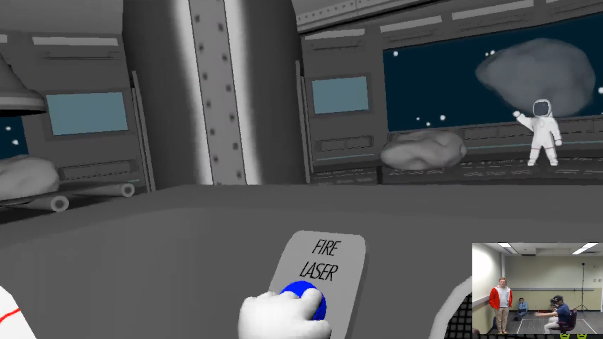
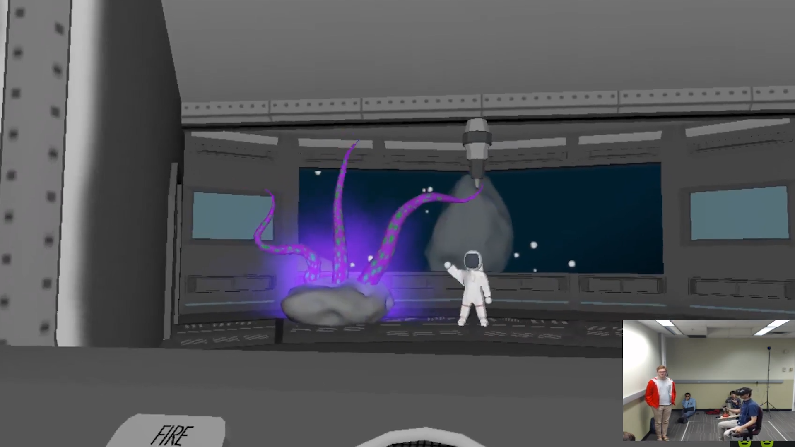
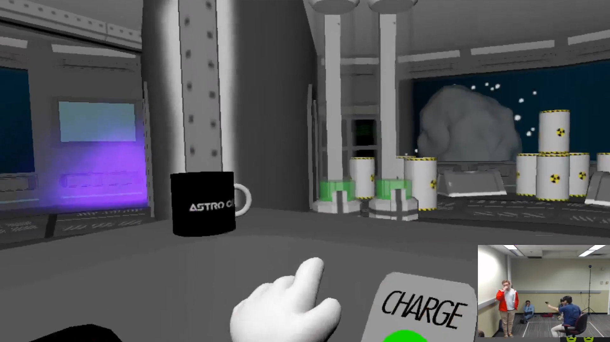
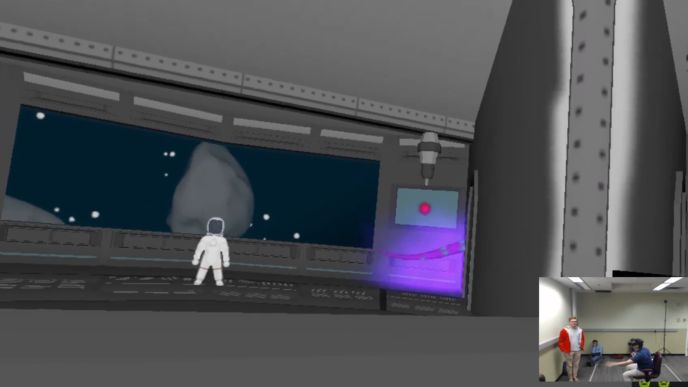
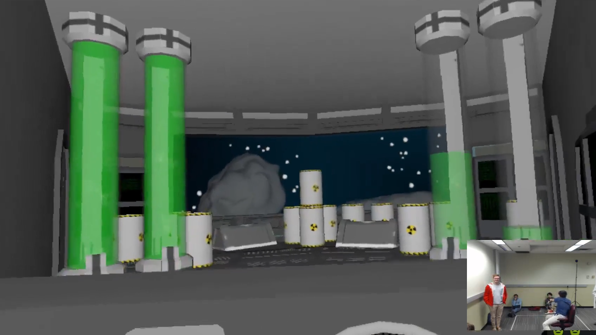
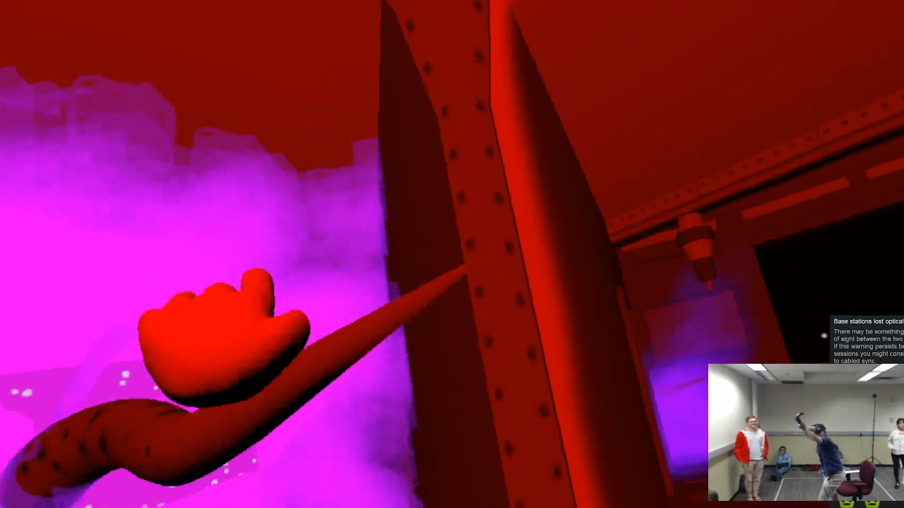

# AstroCo: 499 Days Since Last Accident
**Team Size**: 5 Members  
**Role**: Game Designer, Artist, Co-Producer  
**Engine**: Unity  
**Platform**: VR  
**Duration**: 2 Weeks  

## Project Description
In this first project for the Building Virtual Worlds course, our prompt was to create a world in which you help Character A who's afraid of Character B. 

In this game, you play as the new laser operator in an asteroid mining facility.  When an alien emerges from one of the asteroids, it's up to you to use all of the tools at your disposal to help your co-worker escape!

## Contributions
**Artist**
- Focused on animations, modeling, and texturing. I modeled and textured many of the props found in the environment as well as modeling, texturing, and animating the alien tentacles

**Game Designer**
- Assisted the team in developing ideas for this project, as well as conducting playtests with our own team members and others not associated with the project. At the start of the project, one of our initial ideas was to create a puzzle game with three distinct puzzles. However, after playtesting and discovering that the puzzles would be difficult to understand in a short time, I worked with my team to transition the game into a more action-oriented experience.

**Co-producer**
- Worked with my team to ensure that everyone was aware of what work they had been assigned
- Kept track of overall progress

## Project Media

<iframe width="560" height="315" src="https://www.youtube.com/embed/4wDfwwH7r38" frameborder="0" allow="accelerometer; autoplay; clipboard-write; encrypted-media; gyroscope; picture-in-picture" allowfullscreen></iframe>

 

