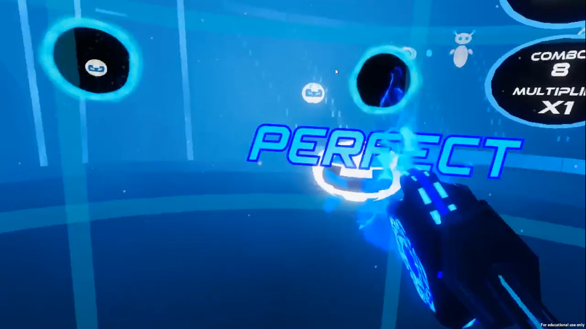
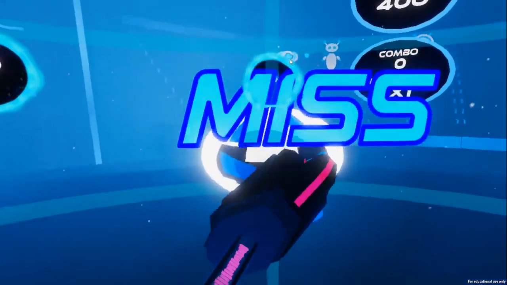
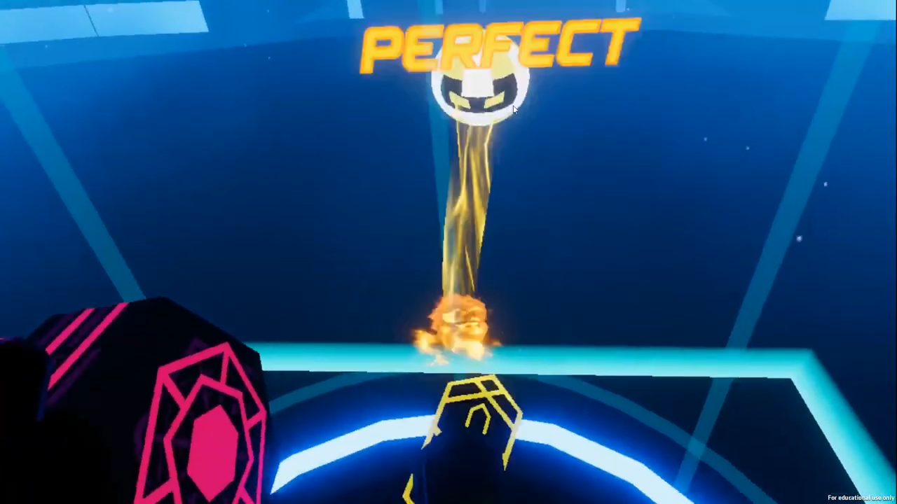
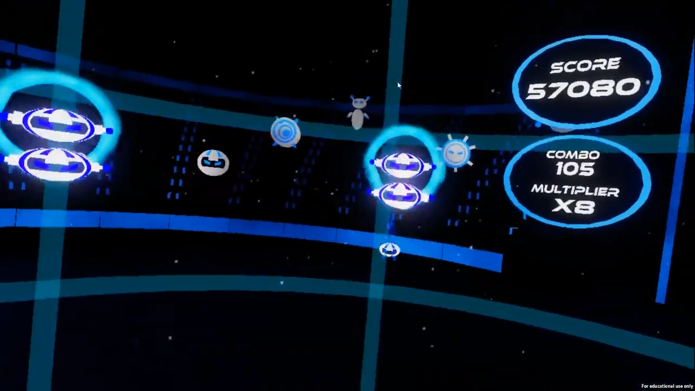
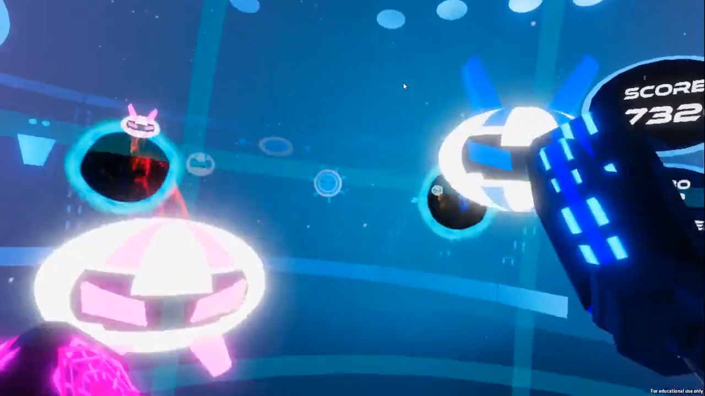
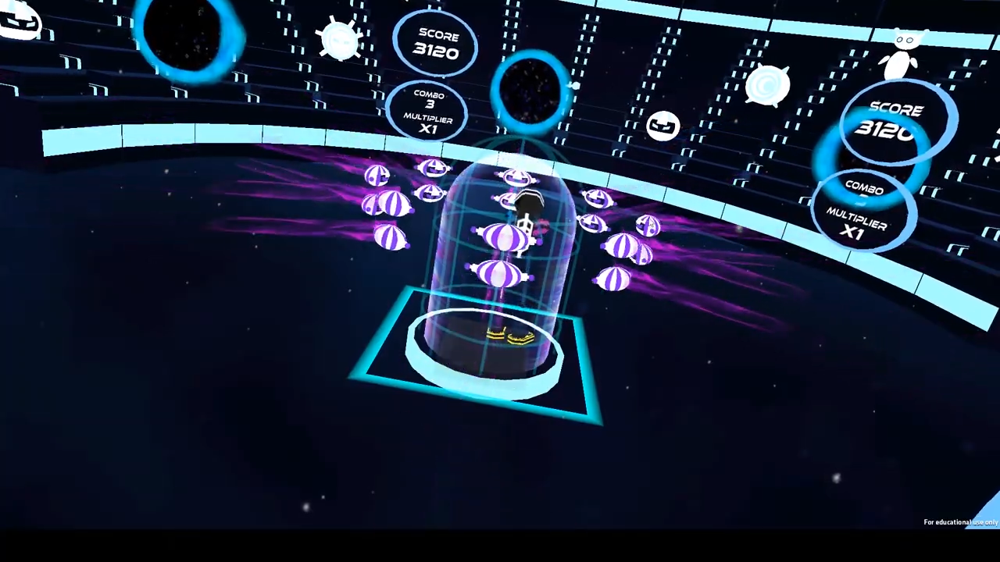

# Beat'Em
**Team Size**: 5 Members  
**Role**: Game Designer, Artist, Co-Producer  
**Engine**: Unity  
**Platform**: VR  
**Duration**: 4 Weeks  

## Project Description
The final project for Building Virtual Worlds was meant to be a culmination of everything else learned throughout the semester. Our goal was to create something fun and interesting that could be shown at the ETC's end of the year showcase.

Beat'Em is a rhythm -action game in which guests punch and kick at robots to the beat of music. It's designed as an arcade experience so that multiple people could play it in a short amount of time.  An online leaderboard for the game was created so guests could see how their scores stacked up against others.

## Contributions
As an **artist**, I worked on developing the playable character, and creating particle effects and post processing effects.

As a **game designer**, I worked with my team to brainstorm ideas for the project. Once the general concept was developed, I conducted playtests with my team members and others not associated with the project. I also developed a tool using Excel that would allow for easier editing of the game's beatmap.

As **co-producer**, I worked with my team to ensure everyone knew what their job was and that they had the tools to complete it. I worked with my other co-producer to make sure each part of the project was done on schedule.

## Project Media

<iframe width="560" height="315" src="https://www.youtube.com/embed/bOFtKliSU2M" frameborder="0" allow="accelerometer; autoplay; clipboard-write; encrypted-media; gyroscope; picture-in-picture" allowfullscreen></iframe>

