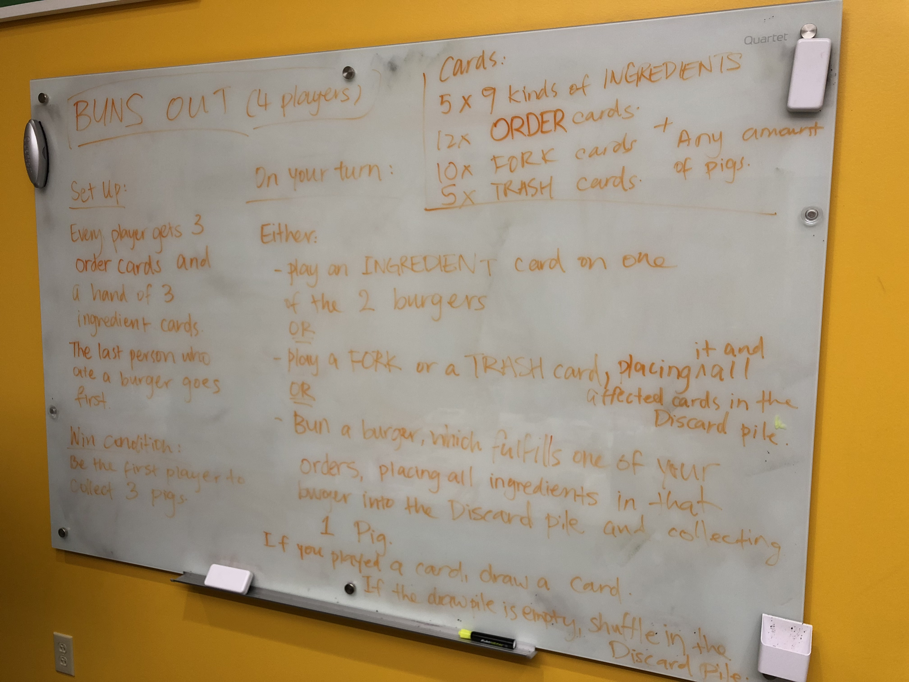
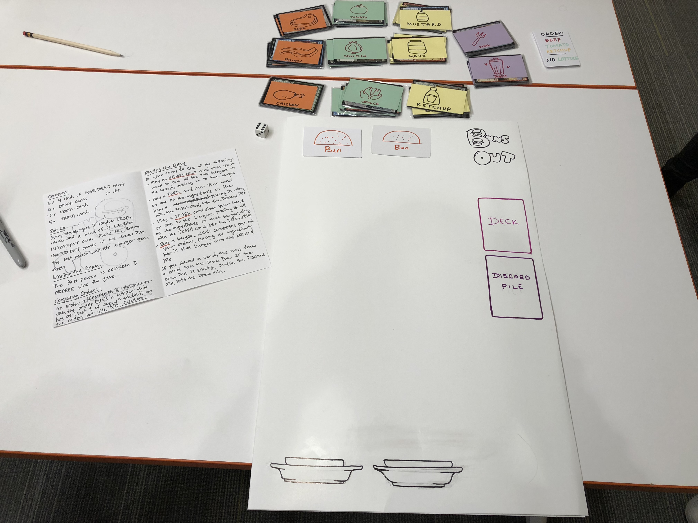
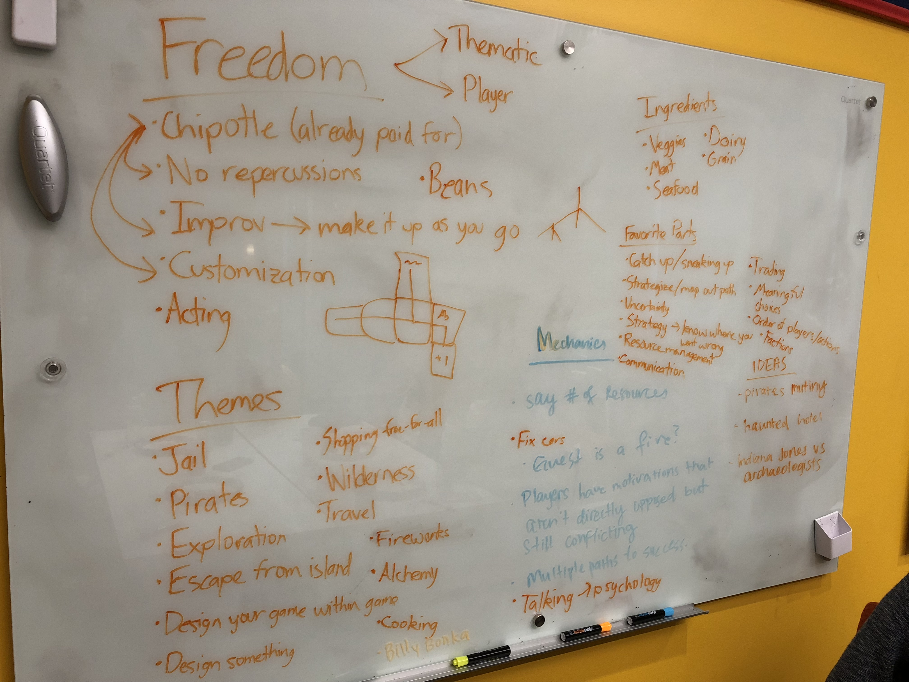
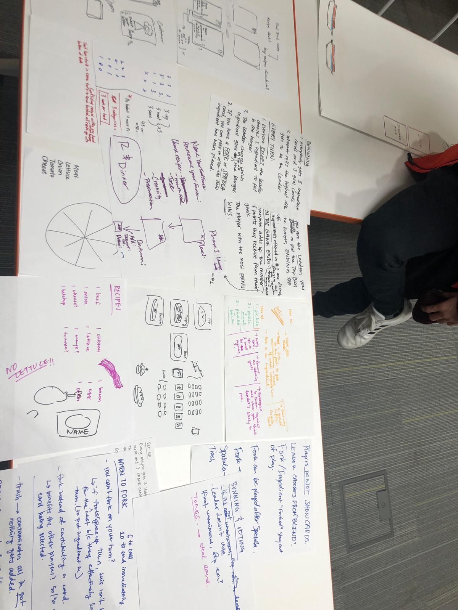
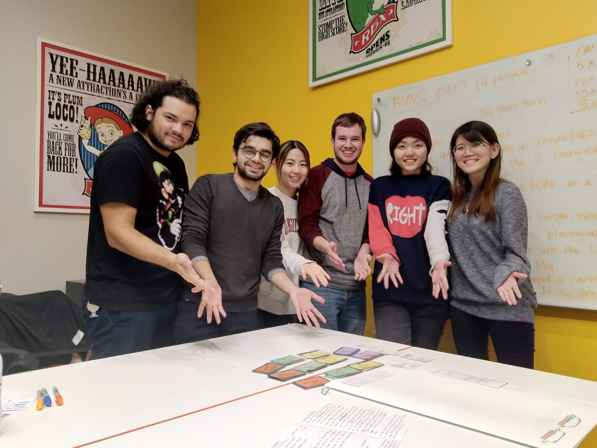

# Buns Out!
**Team Size**: 6 Members  
**Role**: Game Designer  
**Platform**: Board Game  
**Duration**: 12 Hours  

## Project Description
This game was designed for the 2018 PIGDA Board Game Jam.  The team had less than 24 hours to create a board game based on the theme of "Freedom".

"Buns Out!" is a competitive burger-stacking game in which up to four players compete to create burgers that match recipes.  One at a time, players add and remove ingredients from one of two burgers on the board.  Each player has a recipe card that says exactly what they must have (and must not have) on their burger.

## Contributions
**Game Designer**
- Worked with my team towards all aspects of this game, including initial brainstorming, developing game mechanics and ideas, and playtesting

## Project Media

