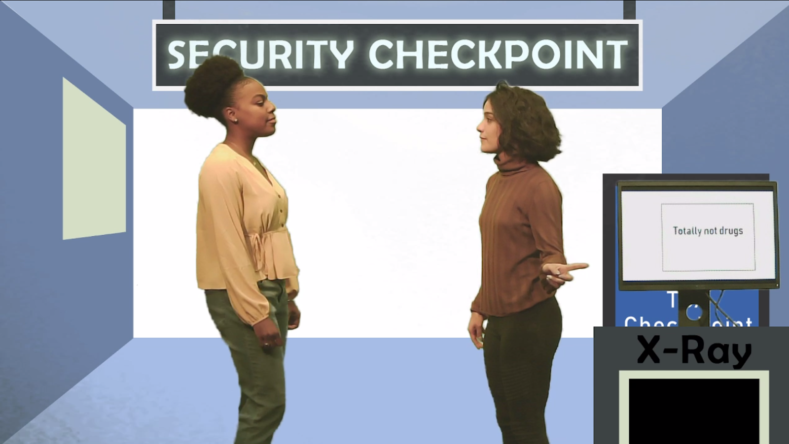

# Commit to the Bits

**Team Size**: 5 Members  
**Role**: Game Designer  
**Engine**: Unity  
**Platform**: PC  
**Duration**: 4 Months  

## Project Description
Commit to the Bits is a discovery project exploring the intersection of improvisational theater and Twitch live streaming. By applying factors unique to Twitch audiences such as their members’ mutual awareness and their potential for dramatic agency, we designed performative frameworks that embrace the character work, active decision-making, and role-playing inherent to improv.

We established the necessary design principles through methodical playtesting and rapid prototyping, quantitatively and qualitatively exploring the mediums’ overlap over the course of the semester. Take a look at our [website](https://www.etc.cmu.edu/projects/commit-to-the-bits/) to learn more!

## Contributions
As a **game designer** on this project, I had many responsibilities. The first of these was leading the team in brainstorming sessions that took on many different formats. These brainstorming sessions led to many ideas that eventually turned into the experiences we fully created. I also built and implemented features into a Unity program that allowed us to switch between games and change stream features, such as the background image or music. Finally, I contributed to the many write ups and postmortems that the team produced over the course of the semester.

## Project Trailer
<iframe width="560" height="315" src="https://www.youtube.com/embed/PqKdXo-p8q4" frameborder="0" allow="accelerometer; autoplay; clipboard-write; encrypted-media; gyroscope; picture-in-picture" allowfullscreen></iframe>  

---

## Twitch Experiences
### Freeze Tag

#### Research Questions
- How does basic improv work on Twitch?
- How is audience attention affected by an extension overlay? 

#### Game Overview
Two performers start a scene of their own choosing. During the scene, the audience submits suggestions for characters, relationships, objectives, and locations. After a period of submissions, four random suggestions are selected (one from each category). Audience members vote on those suggestions until one is declared the winner. 

After a short amount of time, the host or another performer shouts out “Freeze!” and the acting performers freeze in place. Another performer takes the place of one of those currently acting and starts a new scene based on the pose of the replaced performer and involving the winning suggestion from the audience. This game can be repeated indefinitely.

#### Lessons Learned
- The game is easy for performers to pick up, seeing as it’s an adaptation of an existing improv game.

- Audience members mentioned that they wanted more control over the scene, such as by mixing and matching particular actors along with voting.

---

### Whose Bag Is It Anyway?

#### Research Questions
- How can we leverage technology not possible on a live stage?
- What does the immediate context of a background do for viewer understanding?

#### Game Overview
In this game, one performer takes on the role of an airport security agent, and the other a traveller. The traveller is trying to get through security by sending their luggage through baggage check, but the agent notices suspicious items inside. These items, which are submitted by audience members, show up on an x-ray visible to everyone. The traveller must justify the purpose of the items in their luggage and create an emergent narrative tying those objects into a story. Once the performers discuss about three items, they wrap up the scene. New performers then take the stage to start a new scene. Traditionally, the previous traveller becomes the new security guard.

#### Lessons Learned
- This game ended up being our most popular experience. 

- Using the green screen background generated immediate context for viewers coming in halfway through the show or skit.

- The image submission mechanic gave users a large creative space, but with some guiding constraints provided by the theming.

- A smoother, easier way to collect and display images would be a valuable way to spend time.

---

### Discourt

#### Research Questions
- How involved can audience members be as guest stars?
- How involved do audience members want to be in a show?

#### Game Overview
Discourt features two performers - a defendant and a prosecutor. When the scene starts, the prosecutor calls in a witness to testify against the defendant. This witness is an audience member that’s signed up to be called on the Discord social media platform. The witness provides a random statement to the prosecutor (I saw the defendant eating ice cream… with a fork!). The prosecutor and defendant talk back and forth about the statement until a new witness is called to the stand. Eventually, a story is formed from the many random statements put together. Once the scene has ended, a new prosecutor and witness can take the stage.

#### Lessons Learned
- Because the main interaction in this game was joining a voice call on Discord, there was an exceedingly high barrier to entry, which made viewers reluctant to participate.

---

### Music To My Peers

#### Research Questions
- How will audience members with authority affect a performance and its crowd?

#### Game Overview
Two performers on stage ask the audience for a suggestion to start a scene. After receiving a suggestion from the chat, they start the scene. Meanwhile, audience members sign up to be a DJ. The DJ is randomly selected from the pool of willing participants. They pick a generic genre from a list of three available choices (picked randomly from a group of 20 genericized tracks such as Romance or Tragedy). This process is repeated twice more until they have a “playlist” of three songs. They’re encouraged to poll the audience to see what genres the audience wants.

During the scene performed on stage, the host changes the music according to the DJ’s playlist. The performers change the mood and tone of the scene to match the new music. Once all three music choices are finished, the improvisers wrap up the scene. New performers take the stage to start the next scene and a new DJ is selected.

#### Lessons Learned
- This game is surprisingly difficult for performers. Having to react to songs while maintaining a scene is challenging.

- Audience members want more power and control over the performance. They want to manipulate things like when songs change or submit their own songs to play.

---

### Guesstination Unknown

#### Research Questions
- What novel interaction type beyond voting can we produce?
- How will constraining audience interactivity to chat affect conversations?
- How will constraining audience submissions by word type affect submissions?

#### Game Overview
Guesstination Unknown is based loosely on charades. We wanted to create a game where audience members could play alongside the performers. Audience members submit noun, verb, and location suggestions to complete a concept in the format “A \[Noun] \[-ing Verb] in \[Location].” All of the audience suggestions are randomized to create a single concept (A criminal dancing in Paris).

A single performer reads this concept but keeps it a secret from the audience. They perform a scene based on the concept. The audience members guess what the noun, verb, and location are until they collectively have all three correct.

#### Lessons Learned
- This game was received well by audiences, but seemed to be unpopular among the performers. First of all, the concepts created by mixing three ideas were confusing to perform.  Secondly, and most importantly, the performer being able to interact with the chat is very important for a game like this.  Our current setup didn’t allow for this, since the host was the one expected to interact.

- This did lead to a more active chat, which made the stream more lively.

- Objective constraints, such as asking for a noun instead of a contextualized noun, result in inputs harder for the actors to work with and places more responsibility on the audience to be creative.
