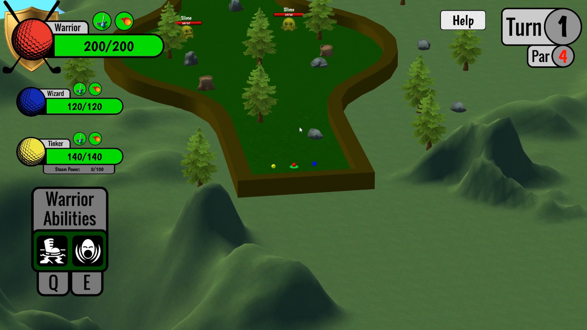
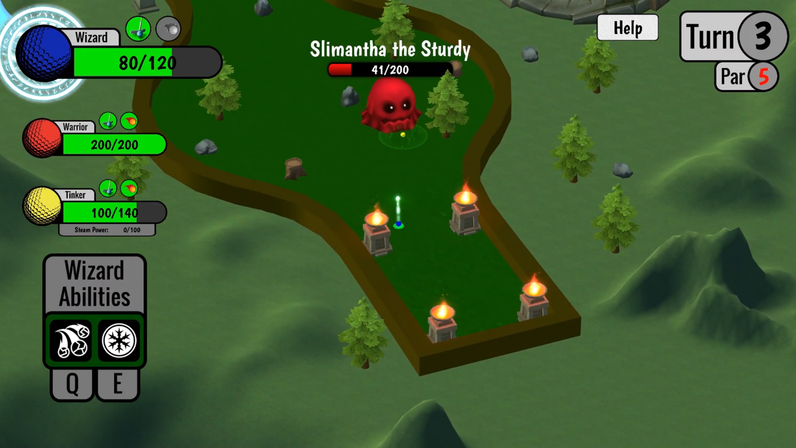
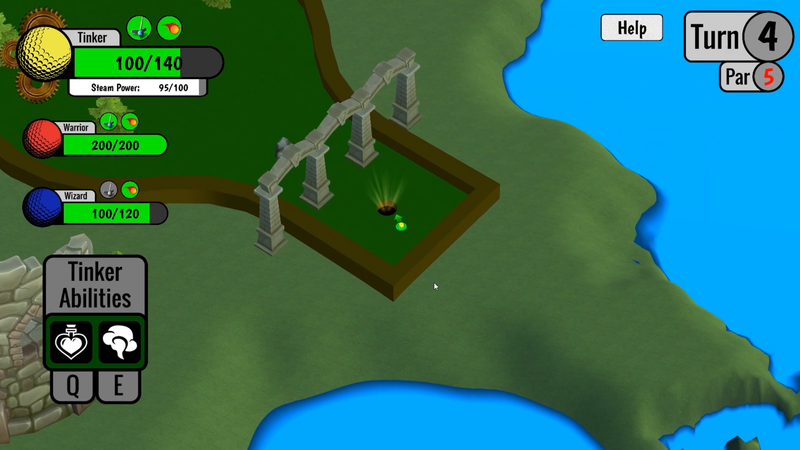

# Dungeon Putter

Dungeon Putter is a game I created for an assignment in my Game Design class. It was designed as a combination of dungeon crawler and mini-golfing game. Players take control of a team of three mini-golf balls that each have unique classes and abilities. To gain access to the hole at the end of the stage, players must use their abilities to defeat all of the enemies on the course.

Play the game [here](https://tdressen.itch.io/dungeon-putter)!

**Role**: Game Designer, Artist, Programmer

<iframe width="560" height="315" src="https://www.youtube.com/embed/lNl43XIlwiE" frameborder="0" allow="accelerometer; autoplay; clipboard-write; encrypted-media; gyroscope; picture-in-picture" allowfullscreen></iframe>

