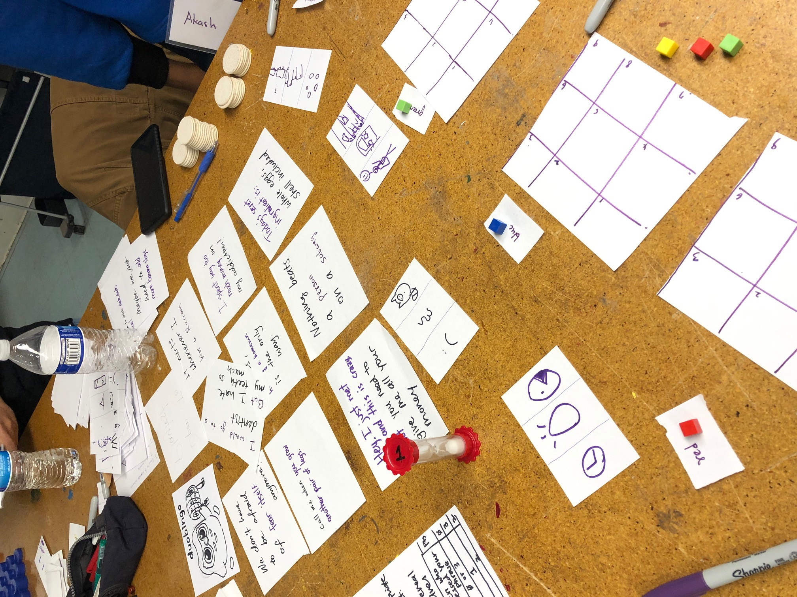
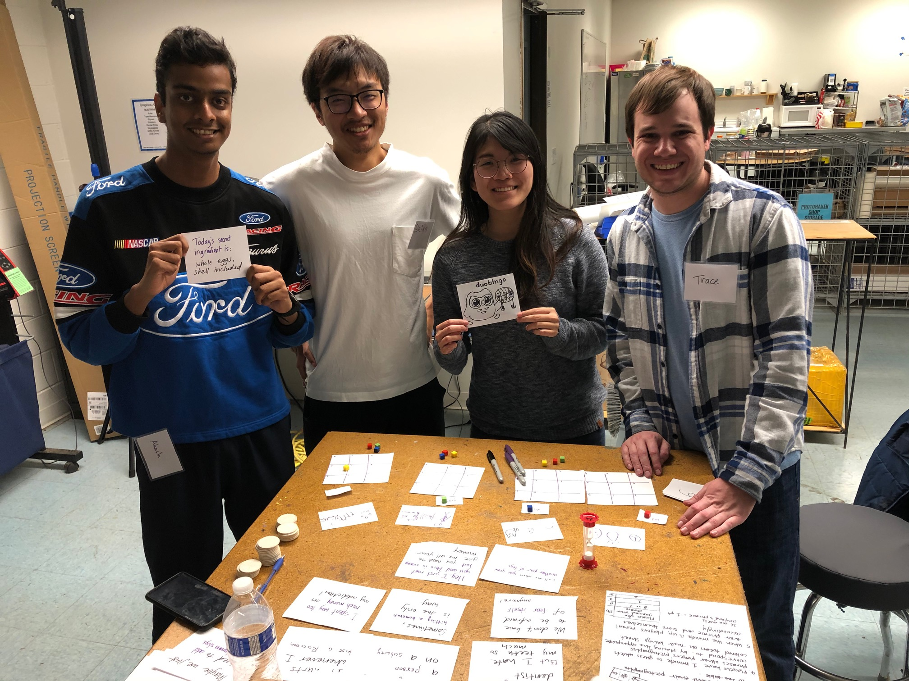
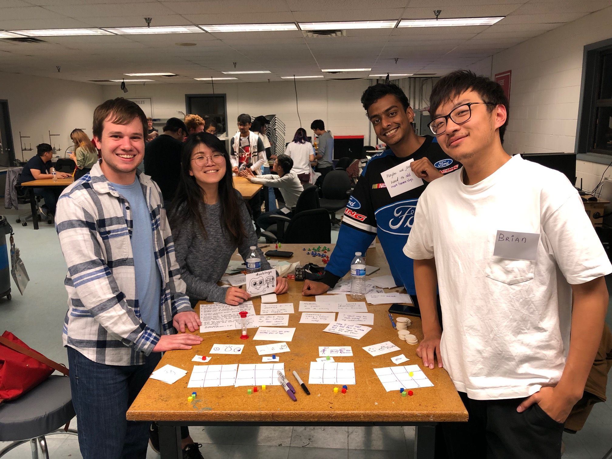
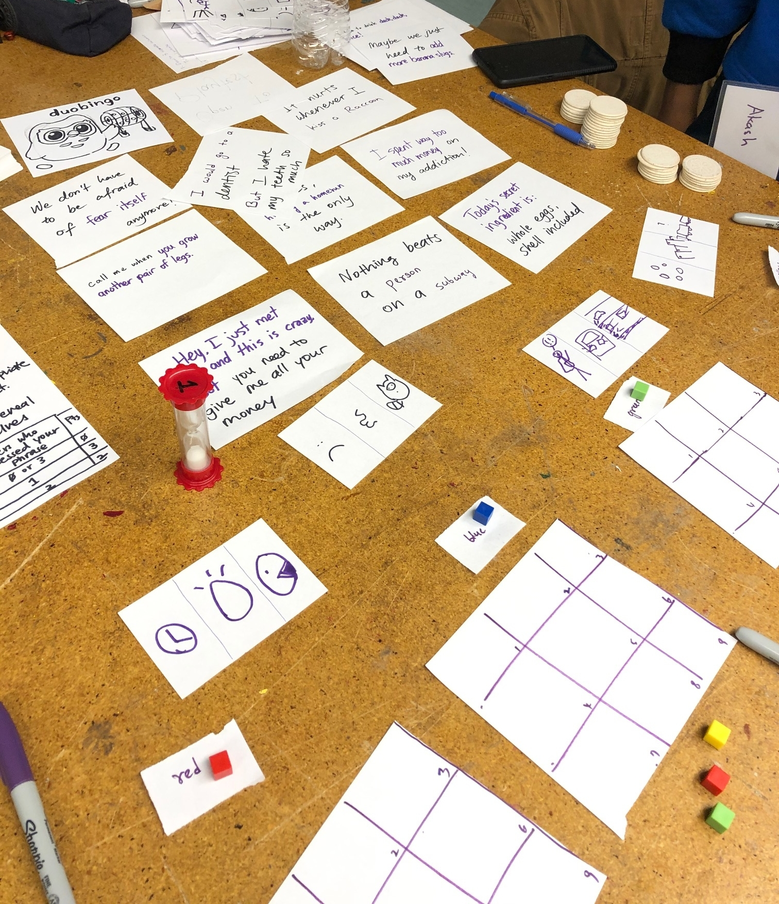

# Duobingo
**Team Size**: 4 Members  
**Role**: Game Designer  
**Platform**: Board Game  
**Duration**: 12 Hours  

## Project Description
This game was designed for the 2019 PIGDA Board Game Jam. The team had less than 24 hours to create a board game based on the theme of "Communication".

"Duobingo" involves players drawing quick symbols or diagrams to try and get their partners to guess a random phrase.

## Contributions
**Game Designer**
- Worked with my team towards all aspects of this game, including initial brainstorming, developing game mechanics and ideas, and playtesting.

## Project Media

