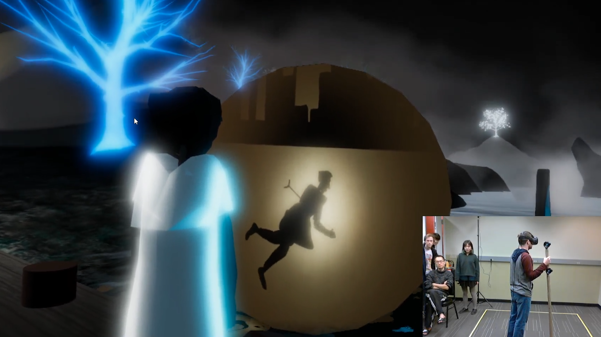
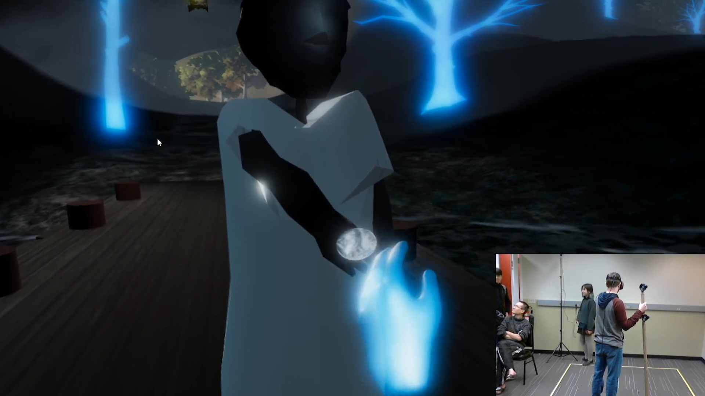
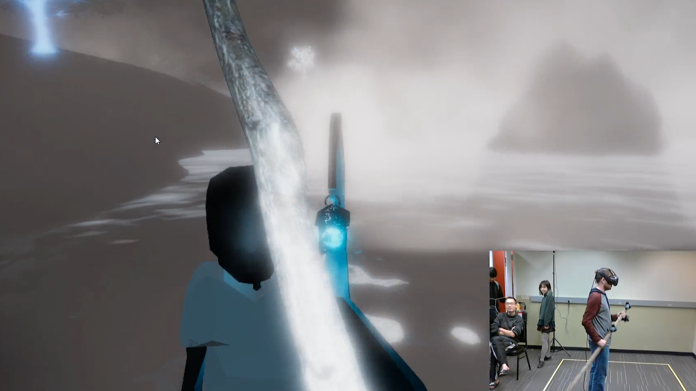
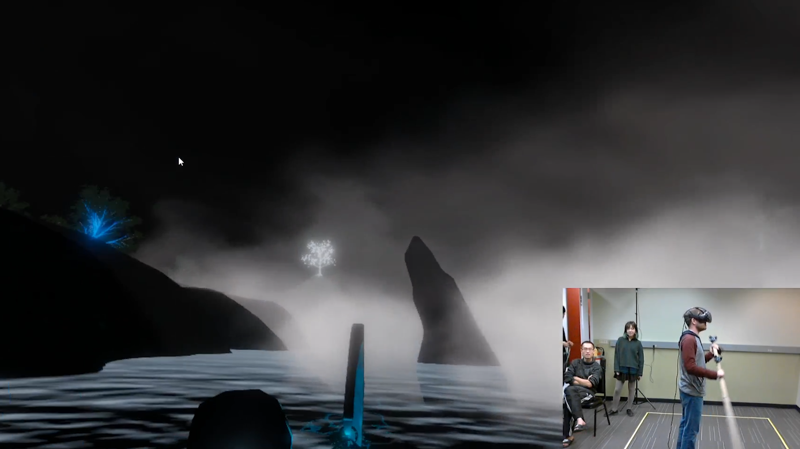
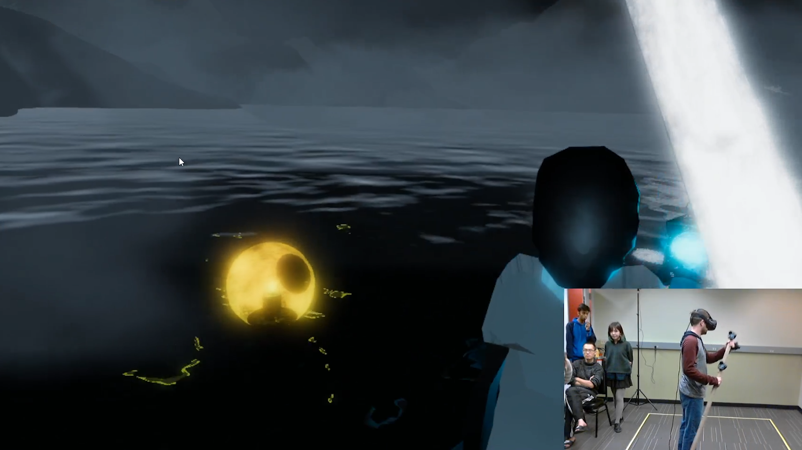
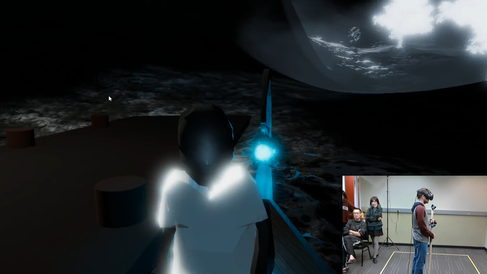

# The Ferryman
**Team Size**: 5 Members  
**Role**: Game Designer, Artist, Producer  
**Engine**: Unity  
**Platform**: VR  
**Duration**: 2 Weeks  

## Project Description
The prompt for this project was to create an experience with a moving story. The result of that project is The Ferryman, a VR experience that incorporates several Vive trackers for real-world props.

The Ferryman puts guests into the role of Charon, ferryman of the River Styx in Greek mythology.  As Charon, they must guide one particular soul (belonging to a man named Theo) across the river and to the afterlife.  Theo, naturally, isn't content with his current state, but when visions his family's future appear along the river, he realizes his impact on their lives and comes to term with his death.

## Contributions
**Artist**
- Modeled the environment, props, and created particle effects. In particular, I had to make sure that environmental effects such as water looked good in VR

**Game Designer**
- Developed ideas for this project
- Conducted playtests with our own team members and others not associated with the project

**Co-producer**
- Worked with my team to ensure that everyone was aware of what work they had been assigned
- Kept track of overall progress

## Project Media
<iframe width="560" height="315" src="https://www.youtube.com/embed/uuuwUrYWHrA" frameborder="0" allow="accelerometer; autoplay; clipboard-write; encrypted-media; gyroscope; picture-in-picture" allowfullscreen></iframe>

