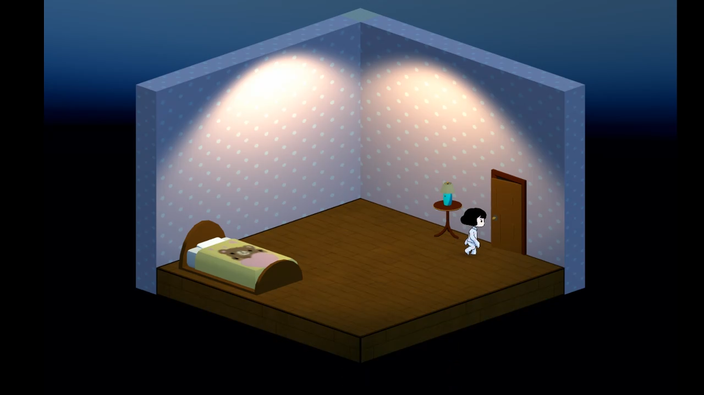
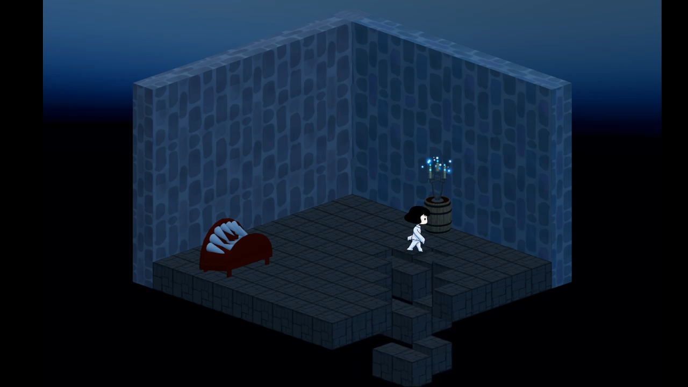
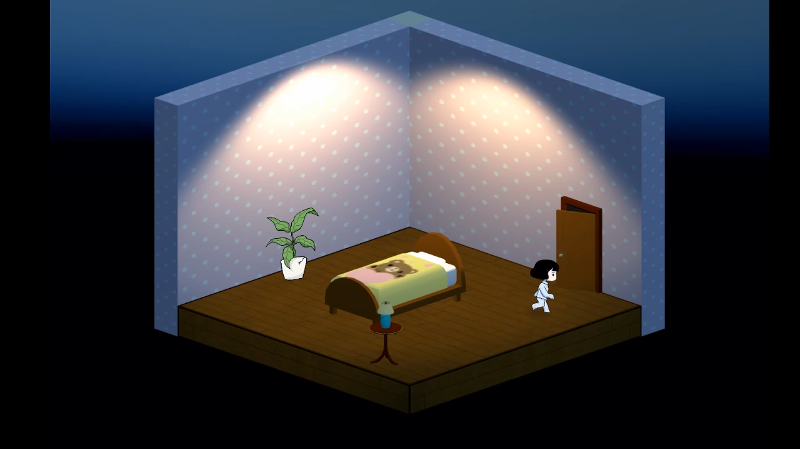
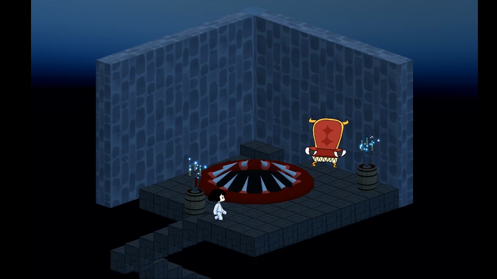
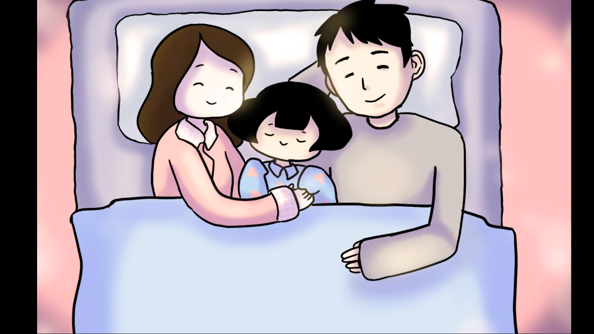
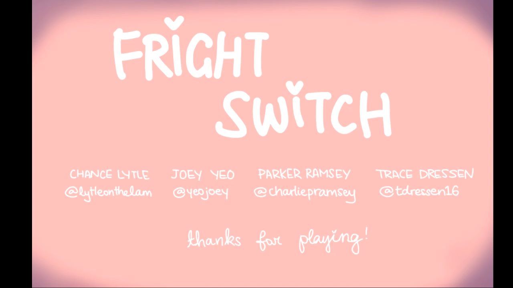

# Fright Switch
**Team Size**: 4 Members  
**Role**: Game Designer, Artist  
**Engine**: Unity  
**Platform**: PC  
**Duration**: 48 Hours  

## Project Description
This game was designed in less than 48 hours for the 2019 Global Game Jam in Pittsburgh.  Our theme was "What does home mean to you?".  It's a tough question, and we spent a long time discussing, but we even settled on an idea we all liked.

In Fright Switch, you play as a young girl who's afraid of the dark.  We all remembered the fear of having to turn out the lights and run up the stairs from the basement as kids, so the idea was based on that.  Everyday objects like chairs & plants can look scary in the dark, so as long as you avoid those before reaching the light, you'll be safe!  Make it to your parents' bedroom before you get too scared!

## Contributions
**Game Designer**
- Worked with my team towards all aspects of this game, including initial brainstorming, developing game mechanics and ideas, and playtesting

**Artist**
- Modeled and textured the various props and environments found in the game.

## Project Media
<iframe width="560" height="315" src="https://www.youtube.com/embed/dRlkqHAKojc" frameborder="0" allow="accelerometer; autoplay; clipboard-write; encrypted-media; gyroscope; picture-in-picture" allowfullscreen></iframe>

