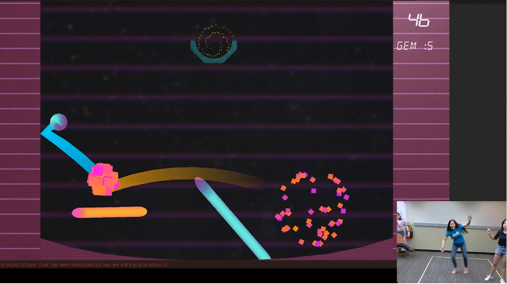
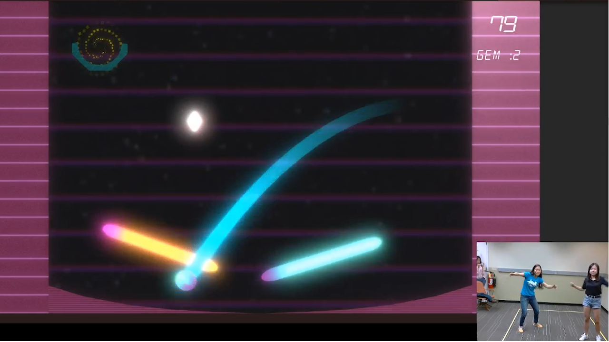
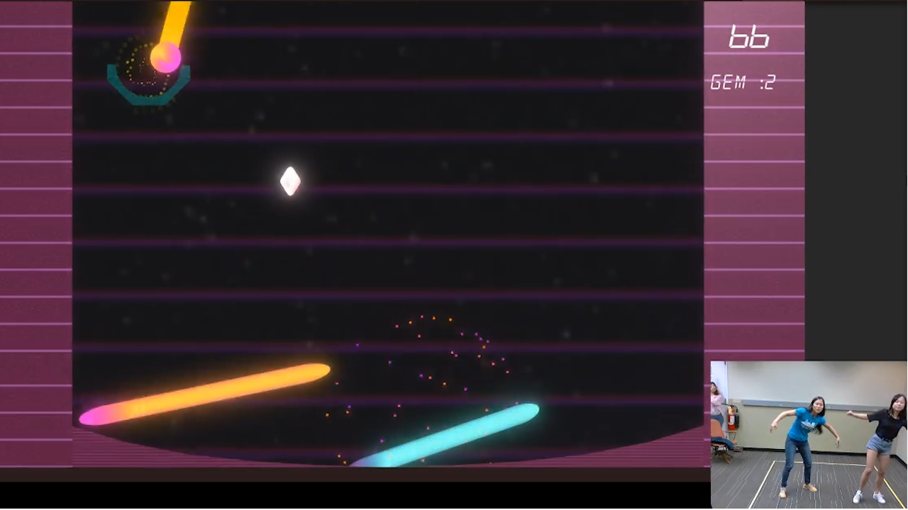

# Neopong
**Team Size**: 5 Members  
**Role**: Game Designer, Artist, Co-Producer  
**Engine**: Unity  
**Platform**: PC w/ Kinect  
**Duration**: 1 Week  

## Project Description
This world was built in Building Virtual World's "Lightning Round". My team had one week to make something fun. Elements like story and characters weren't necessary, as long as the game was fun!

Neopong is a multiplayer, co-operative arcade game where two guests work together to bounce a ball into a goal. They control a paddle with their hands, so by moving around, they can change the location and size of the paddle. The ball can only be hit by a paddle that matches its color, but the ball's color changes after each hit. This way, the guests have to work together to win.

## Contributions
**Artist**
- Focused on learning and implementing post-processing effects for the game. The style of the game was sci-fi-based, so I used lots of bloom to achieve neon effects

**Game Designer**
- Assisted the team in developing ideas for this project
- Conducted playtests with our own team members and others not associated with the project
- Used some programming to implement new gameplay ideas into the game

**Co-producer**
- Worked with my team to ensure that everyone was aware of what work they had been assigned
- Kept track of overall progress

## Project Media
<iframe width="560" height="315" src="https://www.youtube.com/embed/2N7Qym-D9lU" frameborder="0" allow="accelerometer; autoplay; clipboard-write; encrypted-media; gyroscope; picture-in-picture" allowfullscreen></iframe>

