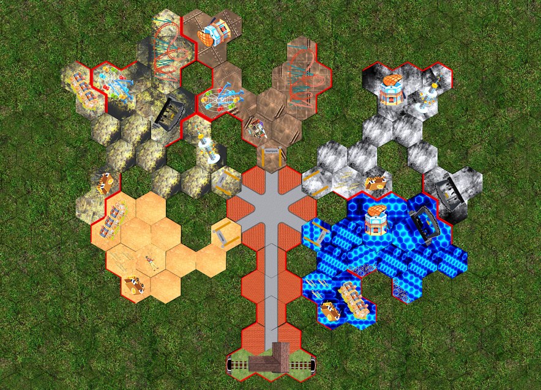
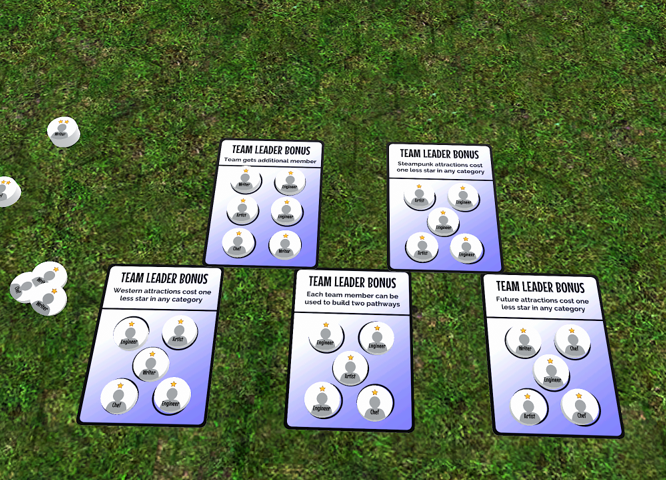
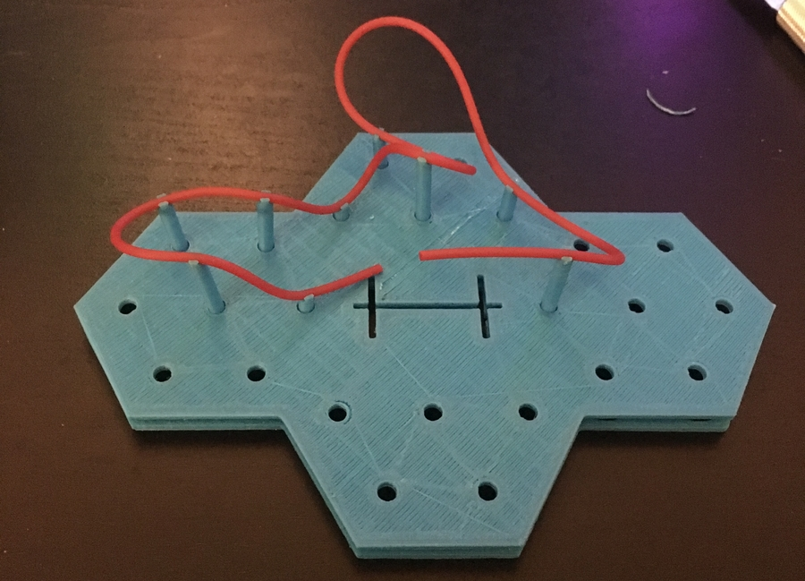
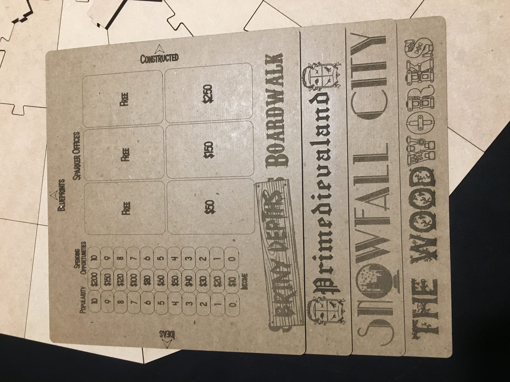

# Theme Sparks
**Team Size**: 1 Member  
**Role**: Game Designer  
**Platform**: Board Game  
**Duration**: 2 Years  

## Project Description
Theme Sparks is a board game based on classic computer games such as Roller Coaster Tycoon. My favorite part of those games was creating cool parks with interesting layouts and themes, rather than focusing on the operations of the park. There are a few board games out there at the moment that focus on theme park operations, so I wanted to make one that was based more on building the park itself.

This game, which is currently in playtesting, allows between two and five players to build their own unique land within a theme park. I'm constantly making changes to the game, so please check out my [blog](https://tracedressen.wordpress.com/) to see more details about it!

## Development

## Project Media

