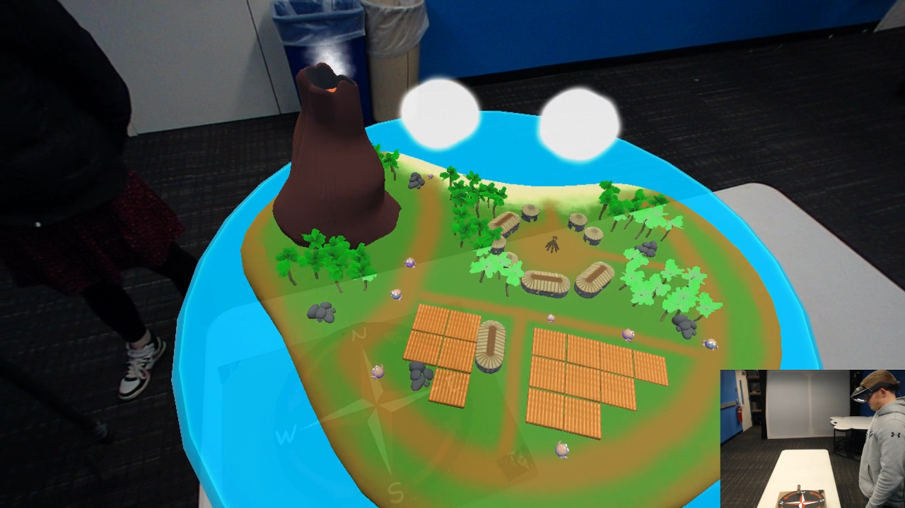
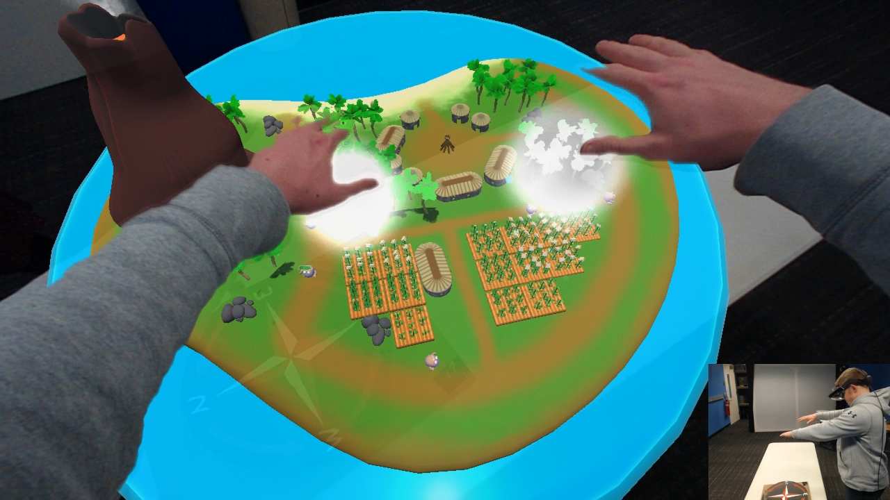
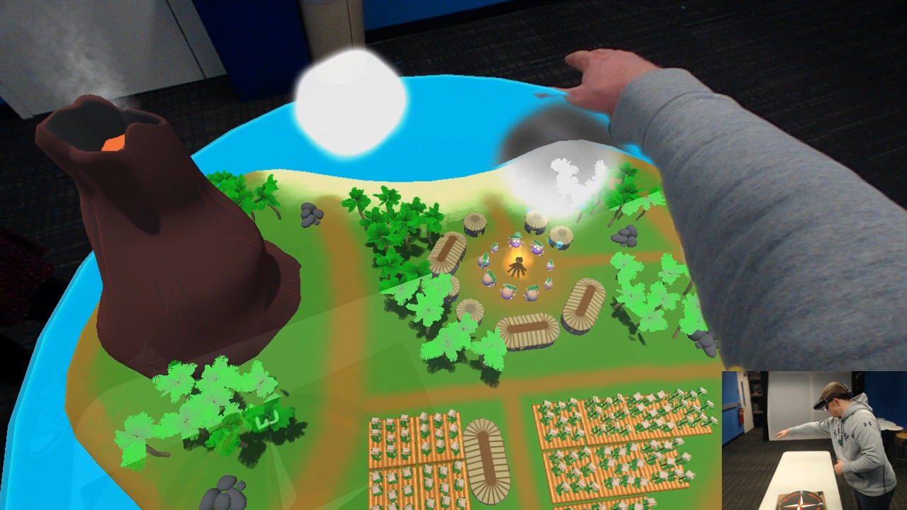
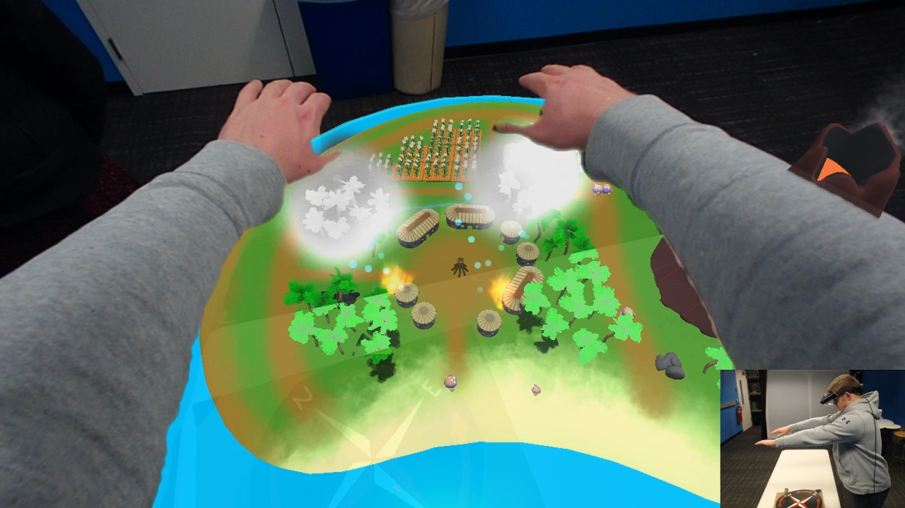
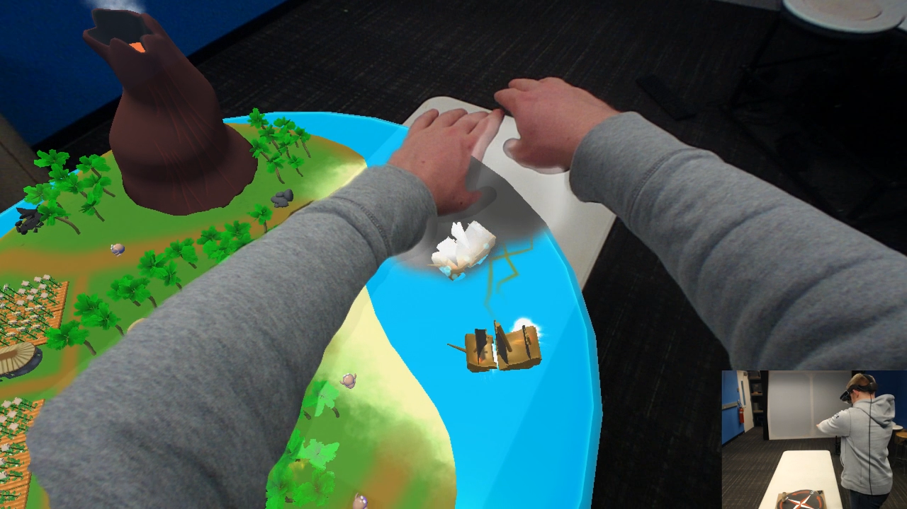
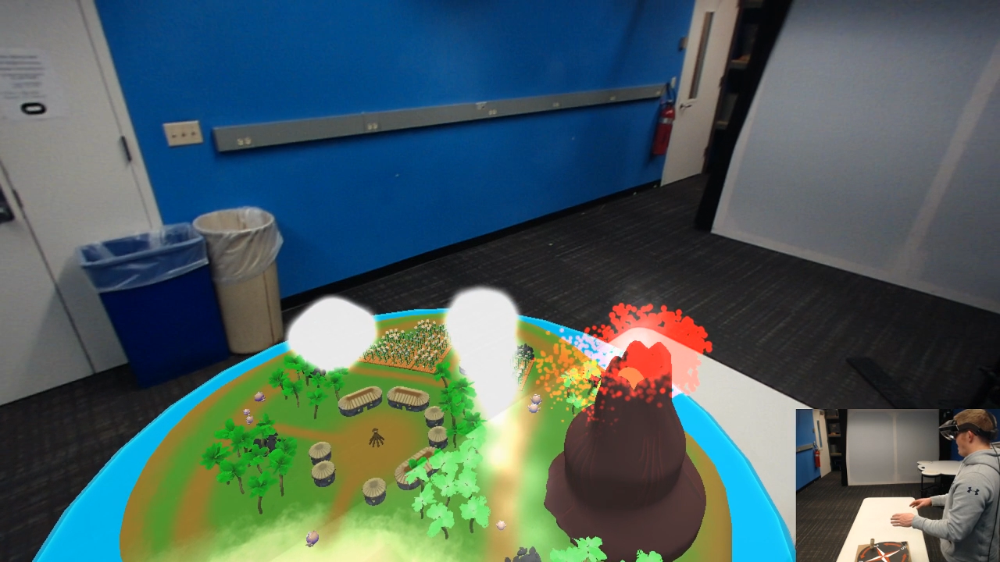

# Weather or Not
**Team Size**: 5 Members  
**Role**: Game Designer, Artist, Co-Producer  
**Engine**: Unity  
**Platform**: Meta 2 Augmented Reality Headset  
**Duration**: 2 Weeks  

## Project Description
The prompt for this project was to create an experience for a "naive guest". In other words, the guest wasn't allowed to know anything about the game before playing, and the game couldn't give any direct instructions on what to do. 

In this game, you play as a weather god overlooking a small tropical island. Using your powers of rain and lightning, you must help the islanders by watering crops, putting out fires, and more.

## Contributions
As an **artist**, I modeled and textured the island and props seen in the game. Alongside that, I also focused on learning and implementing particle effects. Those effects were used in such things as clouds, rain, lightning, fire, and smoke.

As a **game designer**, I assisted the team in developing ideas for this project, as well as conducting playtests with our own team members and others not associated with the project. I also used some programming to implement animations and particle effects into the game.

As **co-producer**, I worked with my team to ensure that everyone was aware of what work they had been assigned, as well as keeping track of overall progress.

## Project Media
<iframe width="560" height="315" src="https://www.youtube.com/embed/JP_kYGaDHCI" frameborder="0" allow="accelerometer; autoplay; clipboard-write; encrypted-media; gyroscope; picture-in-picture" allowfullscreen></iframe>

